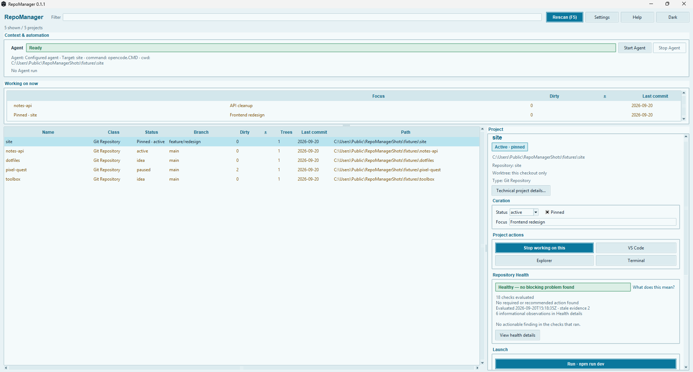
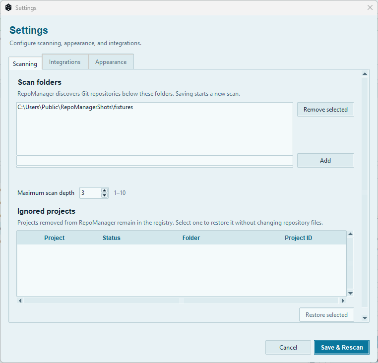
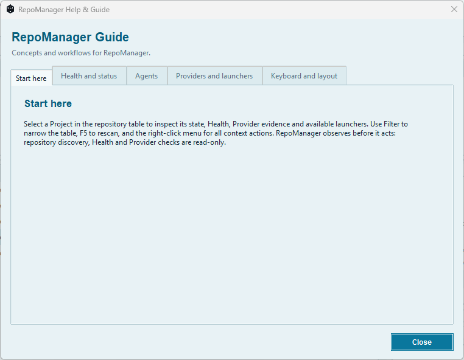

# RepoManager

[](LICENSE)
[](#run-from-source)
[](#platform-and-release)
[](https://github.com/IcyShadow5/RepoManager/actions/workflows/ci.yml?query=branch%3Amain)
[](https://github.com/IcyShadow5/RepoManager/actions/workflows/dependencies.yml?query=branch%3Amain)

RepoManager is a Windows desktop application for discovering, organizing, inspecting,
and launching local Git repositories.

It keeps its own lightweight Project registry on top of Git, combining repository
state with user-owned metadata such as status, focus, pinning, and notes. Repository
discovery and inspection are read-only; actions that can modify a repository require
deliberate user interaction.

Current release: **0.1.1**

## Project context and development

RepoManager is a personal project I created around a practical need: keeping track of
many local repositories, their Git state, current purpose, and the tools used to work
with them.

I drove the project from the original idea through development, troubleshooting,
testing, documentation, release preparation, and public release. The work has included
defining intended behavior, investigating unexpected results, reading and changing
relevant parts of the codebase, checking how modules interact, and verifying changes
through tests and hands-on use.

The project has involved technical problems across several areas rather than one
single feature. Examples include repository discovery and scanning behavior, filtering
and UI behavior, Project and repository state, persistence and recovery, repository
association, launcher behavior, Windows-specific UI details, packaging, and release
workflows.

That work has made RepoManager a practical environment for learning how a larger
application behaves as a system: where state comes from, how it moves through the
application, how failures surface, and how a change in one area can affect another.

## Screenshots

### Main dashboard

Repository state, current work, curation, Health, and project launch actions are
available from the main dashboard.



### Settings

Configure scan folders and discovery depth, and restore projects previously removed
from RepoManager.



### Help and guide

The built-in guide documents RepoManager's main workflows, Health model, launchers,
providers, and keyboard controls.



## Why RepoManager?

Working across many local repositories usually means switching between terminals,
editors, file explorers, Git clients, and project-specific commands while trying to
remember what each repository is currently for.

RepoManager provides one local view of that workspace.

It can:

- discover Git repositories within configured folders;
- inspect branch, HEAD, working-tree, upstream, remote, commit, and Worktree state;
- keep stable Project records with status, focus, pinning, notes, filtering, and sorting;
- surface active projects in **Working on now**;
- evaluate lightweight, read-only Repository Health checks;
- detect supported project launchers and expose them as user-invoked actions;
- open repositories in supported editors, terminals, and file explorers;
- perform user-initiated fast-forward-only Pull operations;
- keep Commit and Push as separate observable steps;
- detect possible repository moves and require confirmation before reconciliation;
- export Project metadata and repository reports as JSON or Markdown;
- associate local repository evidence with supported Provider metadata.

RepoManager is **not** a Git replacement, cloud-sync service, unattended automation
engine, or sandbox for commands it launches.

## Project launchers

RepoManager can detect common project entry points and expose them directly from the
selected Project.

Supported launcher types include:

- batch and command scripts;
- PowerShell;
- npm scripts;
- Python entry points;
- Godot projects;
- Roblox-related project commands;
- WSL and Git Bash shell commands;
- configured custom launchers.

Launcher detection does not execute project code.

A launcher runs only after the user initiates the action.

Configured launchers and Agent commands execute as normal local processes using the
selected working tree as their starting directory. They are not sandboxed and may
execute arbitrary code according to the launched tool or command.

## Repository Health

Repository Health provides lightweight evidence about the selected repository without
modifying it.

Health findings are intended to help identify conditions that may need attention.
They are not a correctness, security, or integrity certification.

A successful Health result means that the checks which ran did not find a blocking
condition; it does not prove that the repository or its software is defect-free.

## Platform and release

RepoManager 0.1.1 supports:

- Windows 10 x64;
- Windows 11 x64.

Linux and macOS are currently deferred. Running the Python source on another platform
does not make that platform officially supported.

The primary distribution is an unsigned portable Windows ZIP built with normal
64-bit CPython 3.14.7.

### Portable release

1. Download `RepoManager-0.1.1-windows-x64.zip` from
   [GitHub Releases](https://github.com/IcyShadow5/RepoManager/releases/latest).
2. Extract the ZIP.
3. Start:

   ```text
   RepoManager\RepoManager.exe
   ```

Git must be available on `PATH`. The portable application does not require a
separate Python installation. The executable is unsigned, so Windows may show an
unknown-publisher or reputation warning.

## Run from source

On Windows, use normal 64-bit CPython 3.14.7 with Tkinter/Tcl/Tk and Git available
on `PATH`.

```text
git clone https://github.com/IcyShadow5/RepoManager.git
cd RepoManager
py -3.14 run.py
```

The application uses the Python standard library; no third-party Python application
packages are required. Packaging has separate build dependencies.

## Tests and documentation

Run the test suite from the repository root:

```text
py -3.14 -B -m unittest discover -s tests -v
```

See [Testing](docs/TESTING.md) for coverage, isolation and runtime verification limits.

- [Architecture](docs/ARCHITECTURE.md)
- [Behavior and data contracts](docs/CONTRACTS.md)
- [Windows release build](docs/RELEASE.md)
- [Contributing](CONTRIBUTING.md)
- [Security reporting](SECURITY.md)

## License

[MIT](LICENSE).
