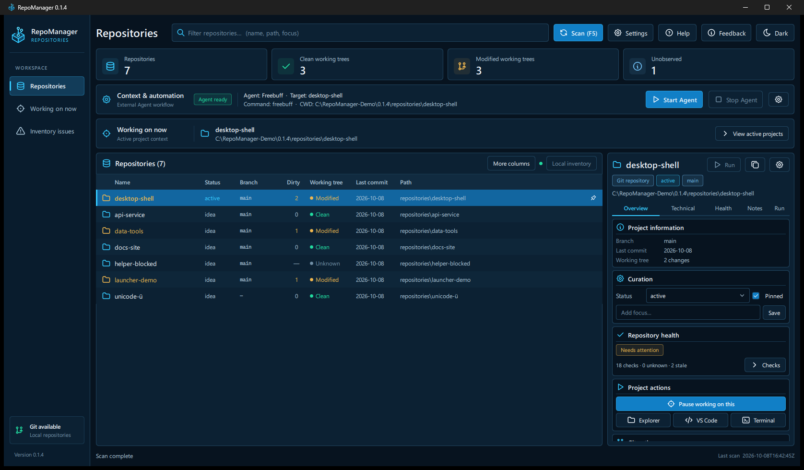
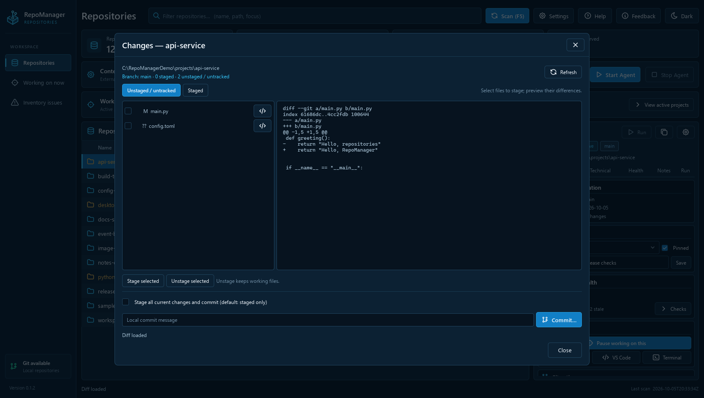
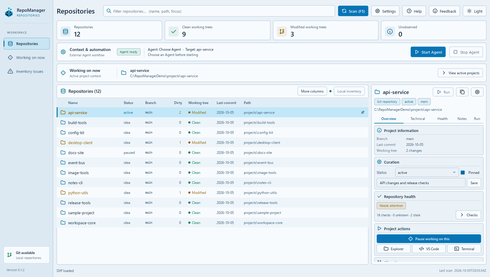

# RepoManager

[](LICENSE)
[](#run-from-source)
[](#getting-started)
[](https://github.com/IcyShadow5/RepoManager/actions/workflows/ci.yml)
[](https://github.com/IcyShadow5/RepoManager/actions/workflows/dependencies.yml)

A Windows desktop tool for developers who keep several local Git repositories.
Find your repositories, review working-tree changes, keep project notes and open
your editor, terminal or Agent from one PySide6/QML interface.

[**Download**](https://github.com/IcyShadow5/RepoManager/releases/latest)
· [Getting started](#getting-started)
· [Documentation](#documentation)
· [Issues](https://github.com/IcyShadow5/RepoManager/issues/new/choose)

[](https://github.com/IcyShadow5/RepoManager/releases/latest)



*The screenshots show the released v0.1.4 application with controlled demo repositories.*

Source version: **0.1.4**. The release badge and Download link identify the latest
published build. See the [v0.1.4 release notes](docs/RELEASE_NOTES_0.1.4.md).

## What it does

- Finds Git repositories under your chosen folders, including linked worktrees.
  Scans run in the background and can be cancelled.
- Shows branches, working-tree changes, remotes and recent commits in a searchable
  repository table.
- Keeps project status, focus, pins, notes and **Working on now** context.
- Reviews Changes/diff, stages or unstages files, commits locally and confirms
  Fetch, Push and fast-forward-only Pull.
- Reports repository Health, with ignore/restore controls for advisory checks.
- Opens Explorer, VS Code and Windows Terminal; detects project launchers for
  Quick Run and offers local Agent selection with managed stop.
- Reviews inventory issues and possible moves, and exports metadata as JSON or
  Markdown.

Dark and Light modes are available. More details are in the
[product guide](docs/PRODUCT.md).

## Screenshots

<details>
<summary>Changes and diff preview</summary>



</details>

<details>
<summary>Light mode</summary>



</details>

## Getting started

Official support: **Windows 10 22H2 / Windows 11 x64**.

1. Open the [Releases page](https://github.com/IcyShadow5/RepoManager/releases/latest).
2. Download `RepoManager-<version>-windows-x64.zip` and extract the complete folder.
3. Start `RepoManager\RepoManager.exe`.
4. In **Settings > Scan folders**, add the folder containing your repositories
   and choose **Save & scan**.

Python and Qt are bundled; a separate Python installation is not needed.
The portable build is unsigned, so Windows SmartScreen may warn or show an
unknown publisher.

**Git must be available on PATH.** If RepoManager cannot find or start Git,
**Install Git** opens the official
[Git for Windows page](https://git-scm.com/install/windows). After installation,
use **Check again**. Restart RepoManager if it still cannot see the updated PATH.

New profiles scan Desktop, Documents and Downloads, not the entire machine.
Scan depth is relative to each root: depth 2 checks the root and up to two nested
folder levels. Choose a nearer root or increase the depth for deeper repositories.
**Add C:\** is an optional whole-drive scan and can take longer or encounter
protected folders. Existing roots are preserved; Cancel discards unsaved changes.

## Git and Agent workflow

Select a repository to view its details. **Changes** shows staged and unstaged
files with a diff preview. Unstage leaves working files intact. Commit defaults
to staged changes and never pushes; stage-all is a separate explicit option.
Push, Pull and Fetch show the destination before confirmation. Pull is
fast-forward-only. See [Git actions](docs/PRODUCT.md#git-actions-and-scan-issues)
for limits and error handling.

**Quick Run** uses the same detected launchers as the full **Run** tab. Multiple
launchers require a choice. External tools are optional: VS Code for its editor
action, Windows Terminal for Terminal, and the relevant runtime for npm, Godot,
Python, Roblox, PowerShell, WSL or Git Bash launchers. Terminal uses Windows
Terminal's default profile; PowerShell 7 is not required for that action.

Freebuff, OpenCode, Codex and Gemini CLI are detected when installed. Freebuff is
preferred when there is no saved Agent selection; valid saved choices remain.
With multiple available Agents, **Start Agent** opens a chooser before launch.
The **Agent Settings** shortcut opens **Settings > Integrations**.

**Selected Agent** and **Fallback / custom Agent command** are separate settings.
Freebuff can be selected while `opencode` remains a configured alternative.
Choosing an Agent does not replace that command. Every Agent start is initiated
by the user and uses the selected repository as its working directory.

## Safety and limitations

- Automatic/read-only Git observation cannot start helper processes. Some Git
  LFS or submodule observations therefore remain **unavailable**, rather than
  being shown as clean. Use an external Git tool in those cases. RepoManager
  does not disable Git LFS. The installed Git executable remains trusted.
- Explicit Git writes/network operations, launchers and Agents are separate
  user actions. They can execute configured code and are **not sandboxed**.
- Health and post-run checks describe observed state; they do not certify
  correctness or approve an Agent's work.
- App data stays under `%LOCALAPPDATA%\RepoManager`, outside managed repositories.
  Exports contain metadata, not repository backups. Review notes, reports and
  screenshots before sharing; arbitrary text is not secret-scanned.
- A selected GitHub remote can trigger a read-only request to `api.github.com`.
  Feedback opens a draft for you to review and submit; there is no automatic
  telemetry or report submission.
- No installer, automatic updater, cloud sync, Agent orchestration or official
  Linux/macOS support is provided. Conflict resolution, branch switching,
  discard/reset/stash, hunk staging and submodule writes need an external Git tool.

For bugs or suggestions, use **Feedback / Bug** in the app or
[GitHub Issues](https://github.com/IcyShadow5/RepoManager/issues/new/choose).
Report vulnerabilities privately through the [security policy](SECURITY.md).
Help > Versions and updates > Official releases opens the release page for
manual comparison and download. WinGet is not the documented installation path.

## Run from source

Requires Windows, Git on PATH and normal 64-bit CPython **3.14.7**, the build/CI
baseline. From the repository root:

```text
py -3.14 -m venv .venv
.venv\Scripts\python.exe -m pip install -r packaging\requirements-qt.txt
.venv\Scripts\python.exe run.py
```

The shipped UI is PySide6/QML. `run_classic.py` retains a source-only Tkinter
reference; it is excluded from the Qt portable package.

## Build and test

[Windows release build](docs/RELEASE.md) describes the pinned PyInstaller build,
runtime notices, matching Qt/PySide sources and integrity manifest.

Run the current product tests in an environment with the Qt and build/tooling
dependencies installed:

```text
.venv\Scripts\python.exe -B -m tests.run_layers --layer current
```

[Testing](docs/TESTING.md) explains the separate test layers and portable/manual
checks. Legacy Tkinter tests are a reference suite, not proof of the shipped UI.

## Documentation

- [Product guide](docs/PRODUCT.md) — projects, Health, Git actions, data and sharing.
- [Architecture](docs/ARCHITECTURE.md) — modules and process responsibilities.
- [Contracts](docs/CONTRACTS.md) — identity, observation and mutation rules.
- [Roadmap](docs/ROADMAP.md) — deferred work.
- [Windows release build](docs/RELEASE.md) — build and redistribution requirements.
- [Testing](docs/TESTING.md) — automated and manual verification.
- [v0.1.4 release notes](docs/RELEASE_NOTES_0.1.4.md).
- [v0.1.3 release notes](docs/RELEASE_NOTES_0.1.3.md) — previous release.
- [v0.1.2 release evidence](docs/RELEASE_EVIDENCE.md) — historical release record.
- [Security policy](SECURITY.md) and [Contributing](CONTRIBUTING.md).

## License

RepoManager is licensed under the [MIT License](LICENSE). Bundled third-party
components retain their own licenses and notices.
